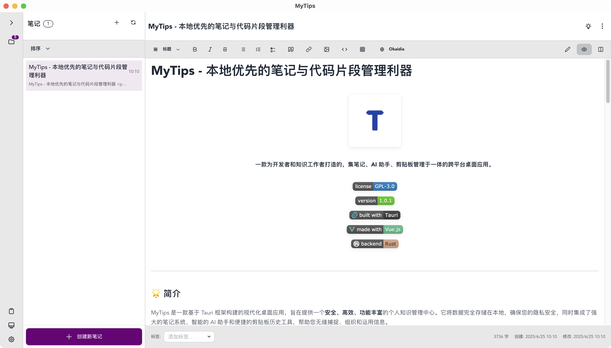

<div align="center">

# mytips

**本地优先的智能笔记与知识管理平台**

*一款专为开发者和知识工作者打造的现代化桌面应用*


[](LICENSE)
[](https://github.com/o0x1024/mytips/releases)
[](https://tauri.app/)
[](https://vuejs.org/)
[](https://www.rust-lang.org/)
[](https://github.com/o0x1024/mytips/releases)

[下载安装](https://github.com/o0x1024/mytips/releases) • [使用文档](#快速开始) • [问题反馈](https://github.com/o0x1024/mytips/issues) • [讨论交流](https://github.com/o0x1024/mytips/discussions)

中文 | [English](README.md)

</div>

## 为什么选择 mytips？

**隐私至上** - 数据完全本地存储，无需担心隐私泄露  
**轻量高效** - 基于 Rust + Tauri 构建，启动快速，资源占用低  
**AI 增强** - 集成多种大语言模型，让 AI 成为您的知识助手  
**原生 Markdown** - 支持标准 Markdown 格式，无厂商锁定  
**实时同步** - 支持多设备数据同步，随时随地访问笔记  
**现代界面** - 精美的用户界面，支持多主题切换

mytips 致力于打造一个**安全、智能、高效**的个人知识管理中心，将笔记记录、AI 对话、剪贴板管理完美融合，帮助您构建属于自己的知识体系。

## 应用截图



## 核心功能

### 智能笔记系统

- **层级管理** - 多层级笔记本结构，像文件系统一样直观组织
- **标签分类** - 灵活的标签系统，支持交叉分类和快速筛选
- **Markdown 编辑** - 所见即所得编辑器，支持实时预览和分屏模式
- **语法高亮** - 内置 100+ 编程语言高亮支持
- **全文搜索** - 毫秒级搜索响应，快速定位任何内容
- **加密保护** - 端到端加密，保护敏感笔记安全
- **导入导出** - 支持 Markdown 文件批量导入导出
- **媒体支持** - 图片拖拽上传，点击放大预览
 
### AI 智能助手

- **流式对话** - 实时显示 AI 回复，支持随时中断生成
- **笔记关联** - 使用 `#` 引用笔记内容，为 AI 提供上下文
- **角色定制** - 创建专属 AI 角色，适应不同工作场景
- **多模型支持** - 集成 OpenAI、Gemini、Claude、DeepSeek、通义千问等主流模型
- **多模态交互** - 支持图片、文档上传，丰富对话内容
- **浮动助手** - 独立浮动窗口，随时随地使用 AI
- **历史管理** - 自动保存对话记录，支持导出分享

### 剪贴板管理

- **历史记录** - 自动记录剪贴板内容，永不丢失重要信息
- **智能过滤** - 自定义规则，保护敏感信息安全
- **快捷操作** - 全局快捷键快速搜索和粘贴
- **多格式支持** - 文本、图片、文件等多种格式预览

### 现代化体验

- **主题定制** - 多种内置主题，支持深色/浅色模式切换
- **原生性能** - Rust + Tauri 架构，启动快速，资源占用低
- **快捷操作** - 丰富的快捷键支持，提升工作效率
- **系统集成** - 托盘常驻，开机自启，全局快捷键
- **响应式界面** - 适配各种屏幕尺寸，完美显示效果

## 下载安装

### 系统要求

- **Windows** 10/11 (x64)
- **macOS** 10.15+ (Intel/Apple Silicon)
- **Linux** Ubuntu 18.04+ / Debian 10+ / Fedora 32+

### 安装包下载

| 平台 | 下载链接 | 文件格式 |
|------|----------|----------|
| Windows | [下载](https://github.com/o0x1024/mytips/releases) | `.msi` / `.exe` |
| macOS | [下载](https://github.com/o0x1024/mytips/releases) | `.dmg` |
| Linux | [下载](https://github.com/o0x1024/mytips/releases) | `.AppImage` / `.deb` |

## 快速开始

### 1. 创建第一篇笔记
```
启动应用 → 点击「新建笔记」→ 开始写作
```

### 2. 配置 AI 助手
```
设置 → AI 助手 → 填入 API 密钥 → 选择模型
```

### 3. 开始 AI 对话
```
AI 助手页面 → 输入问题 → 使用 # 引用笔记
```

## 使用技巧

### 远程数据库支持
下载安装数据库应用
```
https://github.com/tursodatabase/libsql/blob/main/docs/USER_GUIDE.md
https://github.com/tursodatabase/libsql/blob/main/docs/BUILD-RUN.md
https://github.com/tursodatabase/libsql/tree/main/libsql-server
```

生成密钥对
自动生成
```
https://github.com/tursodatabase/libsql/blob/main/libsql-server/scripts

//生成证书
python scripts/gen_certs.py

ca_cert.pem -- certificate authority certificate
ca_key.pem -- certificate authority private key
server_cert.pem -- primary server certificate
server_key.pem -- primary server private key
client_cert.pem -- replica server certificate
client_key.pem -- replica server private key
```

手动生成
```
openssl genpkey -algorithm ed25519 -out ed25519-private.pem             //生成私钥
openssl pkey -in ed25519-private.pem -pubout -out ed25519-public.pem    //生成公钥
```

运行
```
sqld \
  --http-listen-addr 127.0.0.1:8081 \
  --grpc-listen-addr 127.0.0.1:5001 \
  --grpc-tls \
  --grpc-ca-cert-file ca_cert.pem \
  --grpc-cert-file server_cert.pem \
  --grpc-key-file server_key.pem 
  --auth-jwt-key-file ed25519-public.pem   //可选
```

### AI 助手进阶
- **笔记引用** - 对话中输入 `#` 快速引用笔记内容
- **流式控制** - 实时查看回复，随时停止生成
- **浮动模式** - 独立窗口，多任务并行使用
- **对话导出** - 保存重要对话，便于后续参考

### 笔记管理进阶
- **加密保护** - 敏感内容设置密码保护
- **标签体系** - 建立个人标签分类系统
- **快捷操作** - 代码块一键复制，图片拖拽上传
- **搜索技巧** - 支持标题、内容、标签全文搜索

## 技术架构

| 层级 | 技术栈 |
|------|--------|
| **前端框架** | Vue 3 + TypeScript + Vite |
| **UI 组件** | Tailwind CSS + DaisyUI |
| **状态管理** | Pinia + Vue Router |
| **Markdown** | Marked + Prism.js + KaTeX |
| **桌面框架** | Tauri 2.0 + Rust |
| **数据存储** | SQLite + 本地文件系统 |

## 开发

### 环境要求
- **Node.js** `16+` (推荐 `18+`)
- **Rust** `1.70+` (stable toolchain)
- **系统依赖**: 请参考 [Tauri 官方文档](https://tauri.app/v1/guides/getting-started/prerequisites) 完成安装

### 安装与启动

```bash
# 1. 克隆项目
git clone https://github.com/o0x1024/mytips.git
cd mytips

# 2. 安装前端依赖 (推荐使用 yarn)
yarn install

# 3. 启动开发模式
yarn tauri dev
```

## 贡献

我们非常欢迎社区的贡献！如果您有任何想法或建议，请随时提交 [Issue](https://github.com/o0x1024/mytips/issues) 或 [Pull Request](https://github.com/o0x1024/mytips/pulls)。

1. Fork 本仓库
2. 创建您的特性分支 (`git checkout -b feature/AmazingFeature`)
3. 提交您的更改 (`git commit -m 'Add some AmazingFeature'`)
4. 将分支推送到远程 (`git push origin feature/AmazingFeature`)
5. 打开一个 Pull Request

## 隐私与安全

- **本地优先**: 所有数据默认存储在本地，绝不上传至任何服务器
- **API 密钥安全**: 您的 API 密钥经过加密存储在本地
- **开源透明**: 代码完全开源，接受社区的审查
- **加密保护**: 支持笔记本和单个笔记的端到端加密

## 许可证

本项目基于 [GPL-3.0](LICENSE) 许可证开源。

## 致谢

mytips 的发展离不开以下优秀开源项目的支持：

- [Tauri](https://tauri.app/)
- [Vue.js](https://vuejs.org/)
- [Tailwind CSS](https://tailwindcss.com/)
- [DaisyUI](https://daisyui.com/)
- 以及所有在 `package.json` 和 `Cargo.toml` 中列出的依赖库

---

**mytips - 让知识管理更简单、更智能、更安全。**