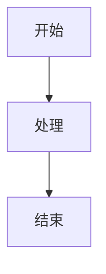

# Mermaid 流程图渲染功能实现

## 实现概述

本次更新为 mytips 项目添加了 Mermaid 流程图渲染功能，支持在 Markdown 中使用 `graph TD` 等 Mermaid 语法创建各种图表。

## 实现细节

### 1. 依赖安装
- 添加了 `mermaid` 依赖包
- 使用 `yarn add mermaid` 安装

### 2. 代码修改

#### markdownService.ts 更新
1. **导入 Mermaid**
   ```typescript
   import mermaid from 'mermaid'
   ```

2. **初始化 Mermaid**
   ```typescript
   mermaid.initialize({
     startOnLoad: false,
     theme: 'default',
     securityLevel: 'loose',
     fontFamily: 'inherit'
   });
   ```

3. **添加 rehypeMermaid 插件**
   - 检测 `language-mermaid` 代码块
   - 使用 mermaid.render() 生成 SVG
   - 将代码块替换为包含 SVG 的 div 容器

4. **更新 rehypeSanitize 配置**
   - 允许 SVG 相关标签和属性
   - 支持 Mermaid 生成的所有 SVG 元素

### 3. 支持的图表类型

- **流程图 (Flowchart)**
  ```mermaid
  graph TD
      A[开始] --> B{条件判断}
      B -->|是| C[操作A]
      B -->|否| D[操作B]
  ```

- **序列图 (Sequence Diagram)**
  ```mermaid
  sequenceDiagram
      participant A as 用户
      participant B as 系统
      A->>B: 请求
      B-->>A: 响应
  ```

- **甘特图 (Gantt Chart)**
  ```mermaid
  gantt
      title 项目计划
      dateFormat YYYY-MM-DD
      section 开发
      任务1 :2024-01-01, 3d
  ```

- **类图 (Class Diagram)**
  ```mermaid
  classDiagram
      class Animal {
          +String name
          +makeSound()
      }
  ```

## 使用方法

1. 在 Markdown 编辑器中创建代码块
2. 指定语言为 `mermaid`
3. 输入 Mermaid 语法
4. 预览模式下会自动渲染为图表

示例：
````markdown

````

## 测试文件

创建了 `test-mermaid.md` 文件用于测试各种图表类型的渲染效果。

## 技术特点

1. **异步渲染**: 使用异步插件处理 Mermaid 渲染
2. **错误处理**: 渲染失败时保留原始代码块并显示错误提示
3. **安全性**: 通过 rehypeSanitize 确保生成的 SVG 安全
4. **样式支持**: 支持自定义样式和主题

## 下一步计划

- [ ] 添加更多 Mermaid 图表类型支持
- [ ] 优化渲染性能
- [ ] 添加主题切换功能
- [ ] 支持自定义 Mermaid 配置

## 完成状态

✅ Mermaid 依赖安装  
✅ rehypeMermaid 插件实现  
✅ 安全配置更新  
✅ 测试文件创建  
✅ 开发服务器启动测试  

功能已完成并可以正常使用。用户现在可以在 Markdown 中使用 Mermaid 语法创建各种流程图和图表。