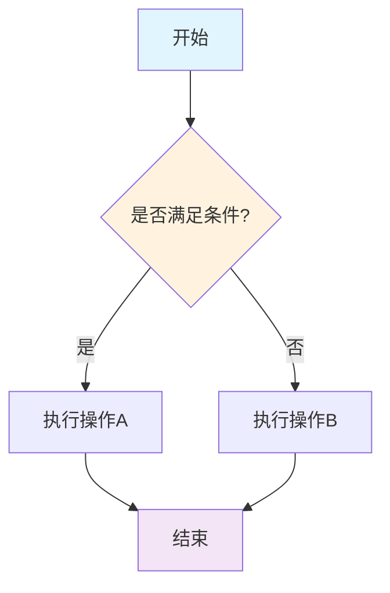
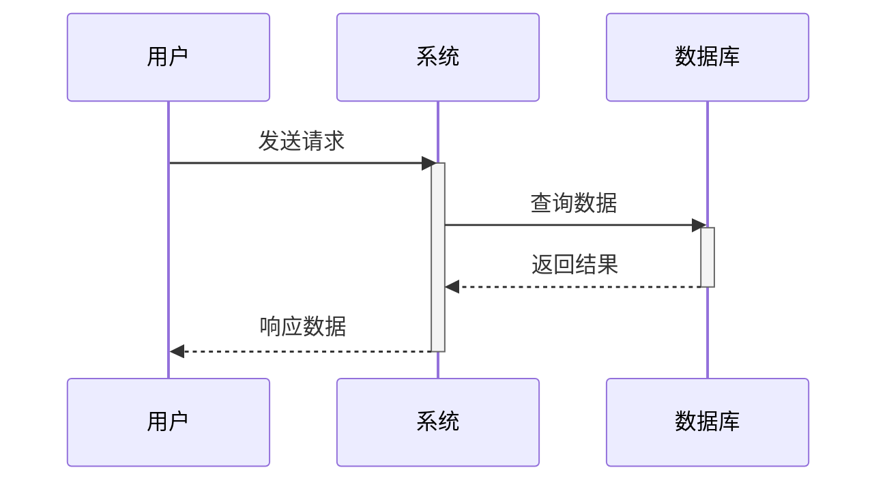
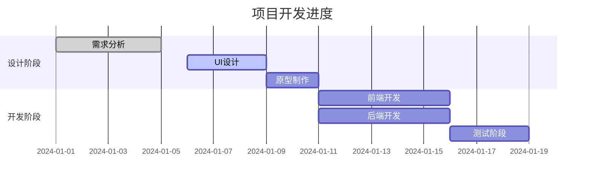
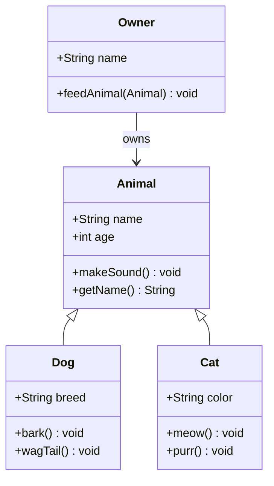
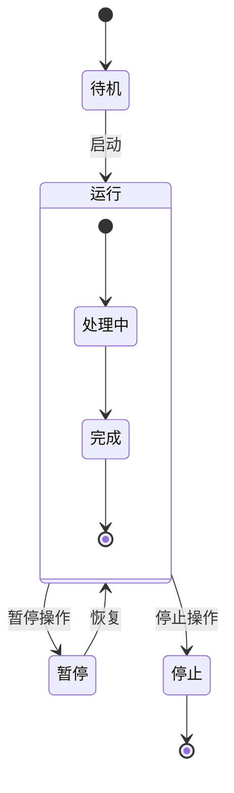
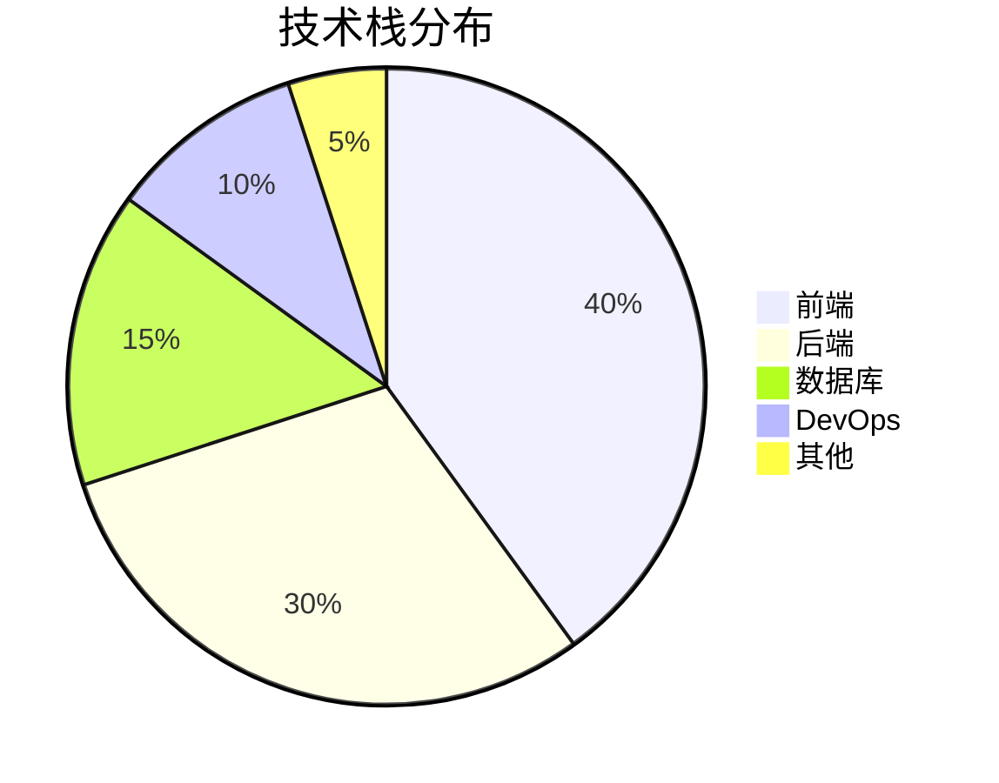
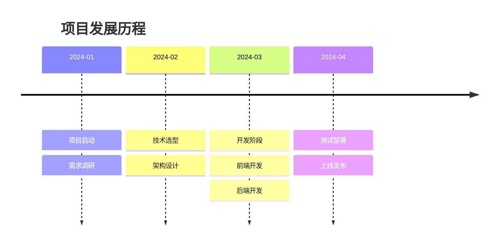

# Mermaid 流程图测试

这是一个测试文档，用于验证 Mermaid 流程图渲染功能。

## 基本流程图

```mermaid
flowchart TD
    A[开始] --> B{是否满足条件?}
    B -->|是| C[执行操作A]
    B -->|否| D[执行操作B]
    C --> E[结束]
    D --> E
    
    style A fill:#e1f5fe
    style E fill:#f3e5f5
    style B fill:#fff3e0
```

## 序列图

```mermaid
sequenceDiagram
    participant U as 用户
    participant S as 系统
    participant D as 数据库
    
    U->>S: 发送请求
    activate S
    S->>D: 查询数据
    activate D
    D-->>S: 返回结果
    deactivate D
    S-->>U: 响应数据
    deactivate S
```

## 甘特图

```mermaid
gantt
    title 项目开发进度
    dateFormat YYYY-MM-DD
    section 设计阶段
    需求分析    :done,    des1, 2024-01-01, 2024-01-05
    UI设计      :active,  des2, 2024-01-06, 3d
    原型制作    :         des3, after des2, 2d
    section 开发阶段
    前端开发    :         dev1, after des3, 5d
    后端开发    :         dev2, after des3, 5d
    测试阶段    :         test1, after dev1, 3d
```

## 类图

```mermaid
classDiagram
    class Animal {
        +String name
        +int age
        +makeSound() void
        +getName() String
    }
    class Dog {
        +String breed
        +bark() void
        +wagTail() void
    }
    class Cat {
        +String color
        +meow() void
        +purr() void
    }
    Animal <|-- Dog
    Animal <|-- Cat
    
    class Owner {
        +String name
        +feedAnimal(Animal) void
    }
    Owner --> Animal : owns
```

## 状态图

```mermaid
stateDiagram-v2
    [*] --> 待机
    待机 --> 运行 : 启动
    运行 --> 暂停 : 暂停操作
    暂停 --> 运行 : 恢复
    运行 --> 停止 : 停止操作
    停止 --> [*]
    
    state 运行 {
        [*] --> 处理中
        处理中 --> 完成
        完成 --> [*]
    }
```

## 饼图

```mermaid
pie title 技术栈分布
    "前端" : 40
    "后端" : 30
    "数据库" : 15
    "DevOps" : 10
    "其他" : 5
```

## 时间线图

```mermaid
timeline
    title 项目发展历程
    
    2024-01 : 项目启动
           : 需求调研
           
    2024-02 : 技术选型
           : 架构设计
           
    2024-03 : 开发阶段
           : 前端开发
           : 后端开发
           
    2024-04 : 测试部署
           : 上线发布
```